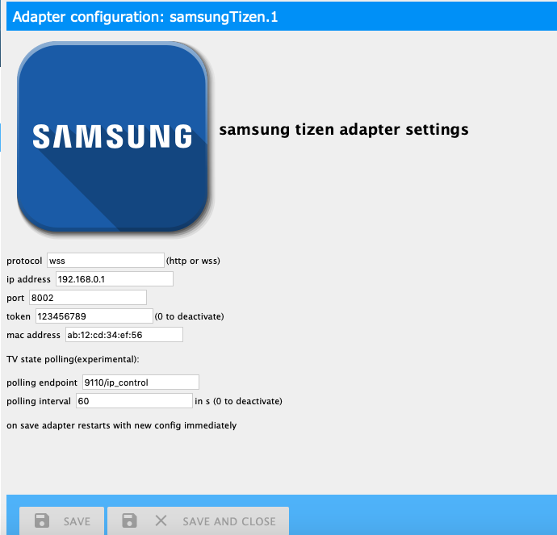

# ioBroker.samsungTizen
=====================

This adapter is to control samsung tvs with tizenOS (>=2016).

## How to install

open iobroker admin in a browser window and go to the adapters tab

1. click on the github icon (install from custom URL)

2. enter this github URL https://github.com/dahuby/iobroker.samsungTizen/tarball/master
3. click on install

4. go back to the adapters tab and search "Samsung Tizen"
5. click on "+" to add a new instance

6. configure the adapter 


## Configuration

How to configure this adapter

### Protocol

Protocol for the websocket connection to your TV.
possible values are http or wss, on newer devices use wss

### IP Address 

IP Address of your Samsung TV

### Port

Port for the websocket connection to your TV.
8001 unsecure port
8002 secure port

### Token 

Token for a secure connection to your TV. 
can be deactiveted with value "0"
#### How to get a token 

Install "wscat" on the device where ioBroker is running with following command:
```sh
npm install wscat
```
Turn TV on and query the token via websocket connection 
```sh
wscat -n -c wss://tvIp:8002/api/v2/channels/samsung.remote.control?name=aW9Ccm9rZXI=
```
a pop up appears on your TV that must be accepted.
take the token from the returned json response
```json
{"name":"aW9Ccm9rZXI="},"connectTime":1575818900205,"deviceName":"aW9Ccm9rZXI=","id":"12345678-797c-45b0-b0f1-233535918548","isHost":false}],"id":"12345678-797c-45b0-b0f1-233535918548","token":"10916644"},"event":"ms.channel.connect"}
```

### MAC Address

MAC Address of your Samsung TV, will be used for WakeOnLAN. 
Does only work if your TV is connected per wire and not wireless.
If your TV is wireless connected it can only powered on from shortStandby.
wakeOnLan can be deactiveted with value "0"
### TV state polling (experimental)

Work on my 2018 model( NU Series7 )

#### Polling Endpoint

a http endpoint to poll the state 
default: 9110/ip_control

#### Polling Interval 

how often the poll request shall be sent
default: 60 seconds
can be deactiveted with value "0"
